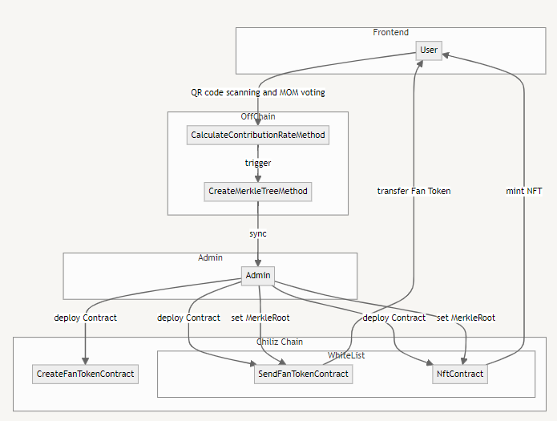
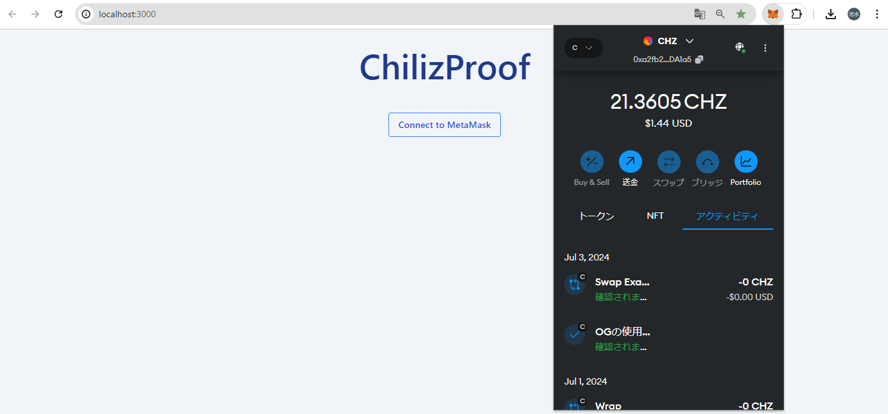
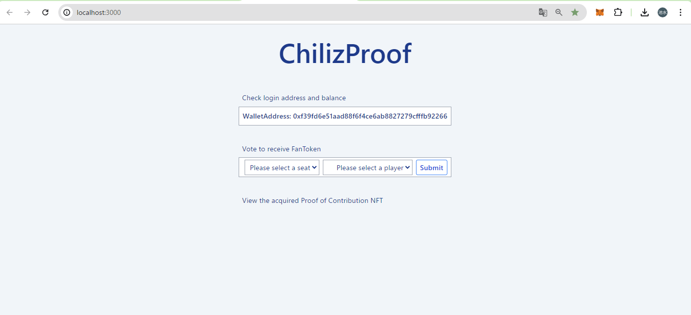
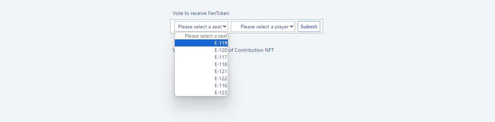
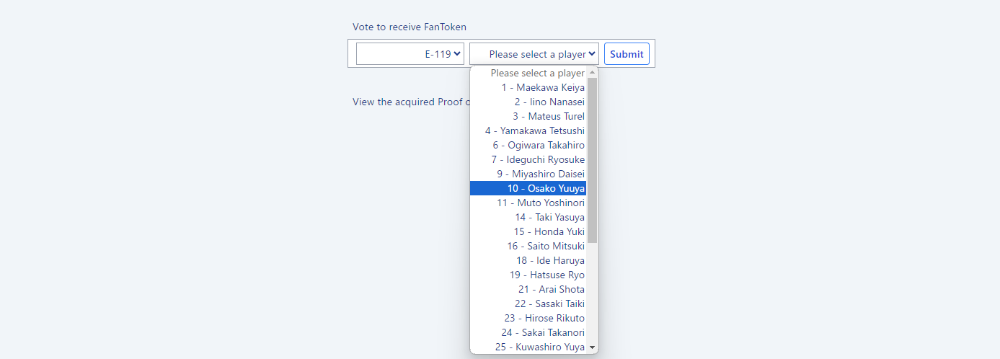
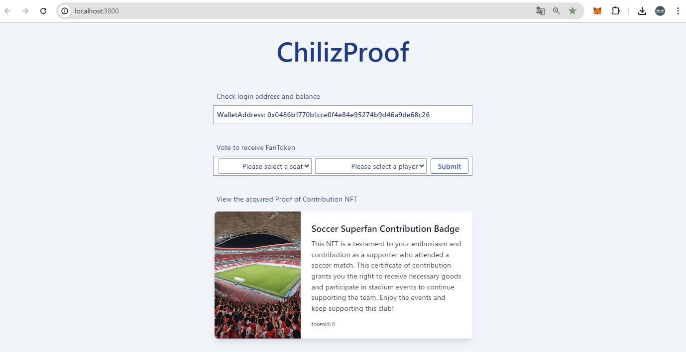

# 🌶 ChilizProof 🌶

<div align="center">
  
</div>

## 🌶 Introduction 🌶

This project aims to address challenges faced by Chiliz, such as fan engagement, ownership, and limitations in interactivity, by distributing fan tokens issued on the Chiliz Chain based on fan contributions and issuing attendance proof NFTs. The token distribution contract based on fan contributions is highly suitable for this purpose due to its versatility, security, and portability. These attributes make it ideal for enhancing liquidity supply of existing fan tokens on the Chiliz Chain. Furthermore, by integrating with Move to Earn platforms like PUML and staking contracts, it can significantly expand opportunities for fan contributions to clubs, thereby greatly enlarging the fan community.

## 🌶 UseCase 🌶

1. Stadium Attendance

    - During stadium attendance, we issue fan tokens and attendance proof NFTs based on contributions, providing access rights to perks and exclusive entry gates. We establish a scheme where seats closer to the cheering leaders can earn more fan tokens through MOM voting at halftime, with winners receiving fan tokens distributed proportionally to their contributions, thereby enhancing fan engagement.

2. NFT Owner Exclusive Community

    - The NFT owner exclusive community issues NFTs as proof of participation to users attending stadium events, granting access to fan community privileges and exclusive entry gates.

3. NFT Games

    - In NFT games, fans can exchange fan tokens for club player NFTs to assemble squads and compete in games against other clubs issuing fan tokens on the Chiliz Chain.

## 🌶 Architecture 🌶

<div align="center">
  
</div>

### Component Relationships

- The Admin deploys the `CreateFanTokenContract`, `SendFanTokenContract`, and `NftContract`.
- When a User scans the QR code assigned to their seat and performs a MOM vote, their address, seat block, and voted player are registered in the system, triggering the `CalculateContributionRateMethod`.
- Using the address and distribution ratios calculated by `CalculateContributionRateMethod`, a Merkle tree is constructed using the `CreateMerkleTreeMethod`.
- A Merkle tree is also constructed using the `CreateMerkleTreeMethod` for an array composed of addresses and distribution quantities.
- The Merkle tree and Merkle proof obtained from `CreateMerkleTreeMethod` are provided to the Admin.
- After the match ends, the Admin registers the Merkle root with `SendFanTokenContract` and `NftContract`.
- The Admin distributes tokens using `SendFanTokenContract`.
- The Admin distributes NFTs using `NftContract`.

## 🌶 Features 🌶

### QR Code scanning functionality

The `QR code scanning functionality` verifies that spectators have indeed attended the stadium by designing a flow to scan QR codes attached to stadium seats and execute subsequent processes.

### CalculateContributionRateMethod

The `CalculateContributionRateMethod` is designed to increase the distribution rate of fan tokens based on two factors: proximity of the fan's seat to the cheering leader's seat and the success of MOM voting results. This allows for distributing rewards commensurate with supporters' levels of contribution.

### CreateMerkleTreeMethod

The `CreateMerkleTreeMethod` builds two types of Merkle trees and makes the resulting Merkle root and Merkle proof available to the operating entity's administrators:

1. It calculates the distribution amount of fan tokens for each address using the `CalculateContributionRateMethod`, converts them into an array, and constructs a Merkle tree.
2. It sets the issuance quantity of 1 NFT for each address, converts them into an array, and constructs a Merkle tree.

These processes enable administrators to manage and utilize the Merkle root and Merkle proof accordingly.

### CreateFanTokenContract

The `CreateFanTokenContract` can issue fan tokens for any club on the Chiliz Chain.

### SendFanTokenContract

The `SendFanTokenContract` can be executed following these steps:

1. Utilize the fan tokens issued by `CreateFanTokenContract`.
2. Register the Merkle root calculated by `CreateMerkleTreeMethod` with the contract.
3. Call the fan token transfer function with the Merkle proof as an argument, enabling the transfer of fan tokens to appropriate addresses based on their allocated amounts.

### NftContract

The `NftContract` can be executed following these steps:

1. Register the Merkle root calculated by `CreateMerkleTreeMethod` with the contract.
2. Call the NFT issuance function with the Merkle proof as an argument, enabling the distribution of NFTs to appropriate addresses based on their allocated quantities.

## 🌶 Features Developed During the Hackathon 🌶

In this hackathon, we developed a prototype of the Features and created a flow scenario demonstrating the interaction of `CalculateContributionRateMethod`, `CreateMerkleTreeMethod`, `CreateFanTokenContract`, `SendFanTokenContract`, and `NftContract`.

The flow involves:
- **User** executing `CalculateContributionRateMethod` and `CreateMerkleTreeMethod`.
- **Admin** executing `CreateFanTokenContract`, `SendFanTokenContract`, and `NftContract`.

Users log in to the site using MetaMask and can verify the distribution results of fan tokens and NFTs.

## 🌶 Usage 🌶

```
git clone git@github.com:ikmzkro/Chiliz-Sports-Hackathon.git && cd Chiliz-Sports-Hackathon
cd frontend && yarn && yarn dev
```

## 🌶 Demo 🌶

1. ユーザがトップ画面にアクセスし、MetaMaskでログインします。

<div align="center">
  
</div>

2. ログイン後の画面を確認します。

<div align="center">
  
</div>

3. ユーザは座席とMOM投票を選択肢Submitボタンをクリックし、管理者に伝えます。

<div align="center">
  
</div>
<div align="center">
  
</div>

4. 管理者はファントークンとNFTを配布します。

5. ユーザはMetaMaskでファントークンの残高を確認します。

6. ユーザはログイン後の画面で受け取ったNFTを確認します。

<div align="center">
  
</div>


## Deployed Contract Address

### Chiliz Spicy Testnet

| Contract Name          | Address                                    |
| ---------------------- | ------------------------------------------ |
| NFTContract            | 0xA65DbdB04BBF78859AD7F17188D8f3663592b62B |
| CreateFanTokenContract | 0xc0f9c4C6c0F426E145d2ba3D3Ef7218950813610 |
| SendFanTokenContract   | 0x19D72055277B0C97d26008E4c922354998eF92dB |

### Sepolia Testnet
| Contract Name          | Address                                    |
| ---------------------- | ------------------------------------------ |
| NFTContract            | 0x0FD92fb94f827B0C7CdC4e673ECC1668457B447d |
| CreateFanTokenContract | 0xfc5B5058b2D159a01dc400891C67B40C27Ede1D3 |
| SendFanTokenContract   | 0x746C1D78e0F428867325bEF9A5f9a46Ab7750A67 |

### Deploy Command
```
npx hardhat run scripts/deployMyNFT.ts --network chiliz

https://testnet.chiliscan.com/token/0xA65DbdB04BBF78859AD7F17188D8f3663592b62B

npx hardhat run scripts/deployFanToken.ts --network chiliz

https://testnet.chiliscan.com/token/0xc0f9c4C6c0F426E145d2ba3D3Ef7218950813610

npx hardhat run scripts/deploySendChilizFanToken.ts --network chiliz

https://testnet.chiliscan.com/address/0x19D72055277B0C97d26008E4c922354998eF92dB
```

## 🌶 License 🌶
This project is licensed under the MIT License.

## 🌶 Team 🌶

For an introduction to our team, click [here](/docs/team.md).

## 🌶 Contact 🌶

Email: ikmzkro@gmail.com

Project Link: https://github.com/ikmzkro/ChilizProof
