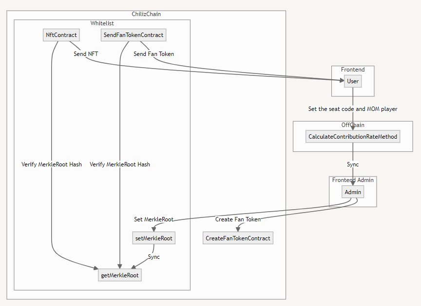

# 🌶 ChilizProof 🌶

<div align="center">
  
</div>

## 🌶 Introduction 🌶

このプロジェクトは、Chiliz Chain上で発行されたファントークンをファンの貢献量に応じて分配したり来場証明NFTを配布することで、Chilizが直面しているファンのエンゲージメント、所有権、インタラクティブ性の制限といった課題に対処することを目的としています。ファンの貢献量に応じたトークン分配コントラクトは、その汎用性、安全性、移植性を持つため、この目的に非常に適しています。これらの特性は、既に発行されたChiliz Chain上のファントークンの流動性供給を拡大することに理想的です。さらに、Move to EarnプラットフォームであるPUMLやStakingコントラクトと連携しクラブへの貢献機会を増やすことで、ファンコミュニティを大幅に拡大させることができます。

## 🌶 UseCase 🌶

1. スタジアム観戦

    - スタジアム観戦では、貢献量に応じたファントークンと来場証明NFTを発行し、特典や専用入場ゲートのアクセス権を提供します。応援リーダーに近い座席ほど、ハーフタイムにMOMの投票を行い結果が当たるほど多くのファントークンを取得可能なスキームを構築し、当選者にはこうけんｙに応じた分配率のファントークンを提供することでファンエンゲージメントを促進します。

2. NFT所有者限定コミュニティ

    - NFT所有者限定コミュニティは、スタジアム観戦に来たユーザに対して参加証明書としてNFTを発行し、ファンコミュニティへのアクセス権や専用入場ゲートのアクセス権を付与します。

3. NFTゲーム

    - NFTゲームでは、ファントークンをクラブ選手のNFTに交換することでスカッドを組み、Chiliz Chain上でファントークンを発行している他クラブで競うゲームに利用できます。

## 🌶 Features 🌶

### CalculateContributionRateMethod

CalculateContributionRateMethodは、ファンの座席が応援リーダーの座席に近いほど、MOM投票結果が正解であるほど、ファントークンの分配率を高めるような設計を行うことで、サポータの貢献量に応じた報酬を分配することができます。

### WhitelistContract

WhitelistContractは、CalculateContributionRateMethodによって導出されたアドレスと分配率の対応を配列に格納後、マークルツリーを計算します。計算結果のマークルルートはオンチェーン上で管理された状態ます。

### NftContract

NftContractは、スタジアムに観戦しにきたファンに対して試合への貢献証明としてNFTを発行します。

### SendFanTokenContract

SendFanTokenContractは、スタジアムに観戦しにきたファンに対してCalculateContributionRateから導出されたファントークンを試合への貢献報酬として発行します。ホワイトリストによって管理されたアドレスと分配率を用いてトークンを安全に発行できるように制御します。

### CreateFanTokenContract

CreateFanTokenContractは、Chiliz Chain上で任意クラブのファントークンを発行することができます。

## 🌶 Features Developed During the Hackathon 🌶

このハッカソンでは、Featuresのプロトタイプを開発し、Fan、CalculateContributionRateMethod、NftContract、そしてSendFanTokenContractの相互作用を示すフローシナリオを作成しました。

このシナリオでは、UserがCalculateContributionRateMethodを呼び出し、サイト管理者がNftContract、SendFanTokenContractをトリガーします。

UserはMetaMaskでサイトにログインし、その結果を確認できます。

## 🌶 Usage 🌶

```
git clone git@github.com:ikmzkro/Chiliz-Sports-Hackathon.git && cd Chiliz-Sports-Hackathon
cd frontend && yarn && yarn dev
```

## 🌶 Demo 🌶

## 🌶 Architecture 🌶

<div align="center">
  
</div>

### Component Relationships

- 管理者は独自のファントークンをCreateFanTokenContractで作成
- UserはCalculateContributionRateMethodに対してアドレスと座席コードとMOMプレイヤーを送信
- CalculateContributionRateMethodは各アドレスに対する分配率を求め、Merkle RootとMerkle Proofを導出
- 管理者はMerkle RootをChilizChainに設定
- SendFanTokenContractはgetMerkleRootで検証を行い、問題なければFanTokenを指定アドレスに指定分配率だけ配布
- NftContractはgetMerkleRootで検証を行い、問題なければNFTを指定アドレスに1枚だけ配布

## 🌶 License 🌶
This project is licensed under the MIT License.

## 🌶 Team 🌶

For an introduction to our team, click [here](/docs/team.md).

## 🌶 Contact 🌶

Email: ikmzkro@gmail.com

Project Link: https://github.com/ikmzkro/ChilizProof
